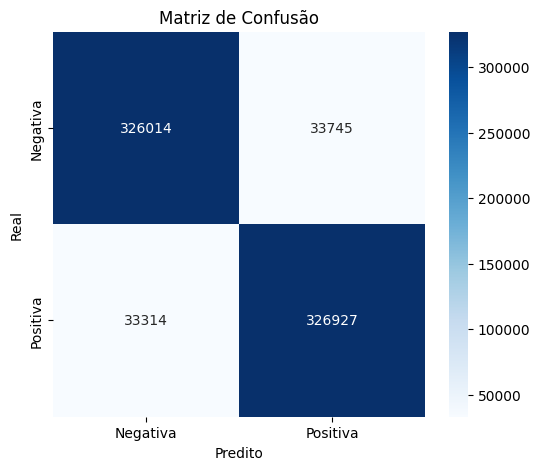
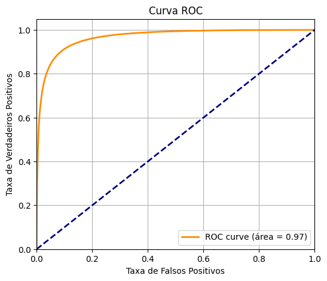

# Projeto de Análise de Sentimentos com Avaliações da Amazon

Este projeto tem como objetivo implementar um pipeline de MLOps nível 0 para classificar automaticamente sentimentos (positivo/negativo) em avaliações de produtos da Amazon.

## 📂 Dataset

Utilizamos o dataset [Amazon Review Polarity](https://www.kaggle.com/datasets/kritanjalijain/amazon-reviews), obtido via `kagglehub` no Google Colab. Ele contém reviews rotulados como positivos (2) ou negativos (1).

## ⚙️ Etapas do Projeto

1. **Aquisição dos dados** via `kagglehub`
2. **Pré-processamento** dos textos (`data_cleaner.py`)
3. **Vetorização** com `TfidfVectorizer`
4. **Treinamento** com `LogisticRegression`
5. **Avaliação** com `accuracy_score`
6. **Exportação** do modelo (`joblib`)
7. **Predição em tempo real** com função `predict_sentiment`

## 📝 Tecnologias utilizadas
- Python 3
- scikit-learn
- pandas
- seaborn / matplotlib
- joblib
- kagglehub

## 🧠 Modelo

O modelo utilizado foi uma Regressão Logística, escolhida por ser simples, rápida e eficaz para tarefas de classificação binária em textos vetorizados.

## 📊 Resultados

Acurácia obtida: **90,68**

Matriz de Confusão:  

Curva ROC:  


O modelo se mostrou consistente e capaz de prever sentimentos corretamente em exemplos fora do treino.

## 🛠 Como usar

Clone o repositório e execute o notebook:

```bash
git clone https://github.com/seuusuario/seurepo.git

Abra e rode o notebook no Google Colab. Para testar predições, use a função:
predict_sentiment("This product is great!")
